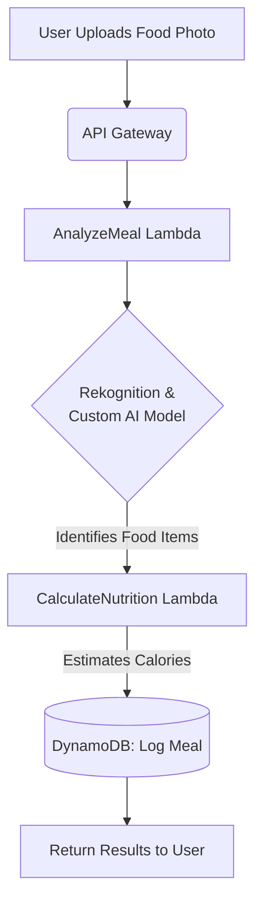

I will outline the core structure and key sections for a comprehensive README.md for a CalAI-like application. Since the search results lack specific technical details about CalAI's functions, I will define common features for a photo calorie app based on general health tech knowledge.

## 📋 Project Overview: CalAI - AI-Powered Calorie Tracker

**CalAI** is a serverless application that uses AI to estimate the calorie content and nutritional information of food from a photo. It provides a seamless alternative to manual food logging.

```bash
# Prerequisites: Node.js, Python, AWS CLI, AWS SAM CLI
git clone <your-repository-url>
cd calai-backend
sam build
sam deploy --guided
```

## 🏗️ System Architecture

The application uses an event-driven, serverless architecture on AWS for scalability and cost-efficiency.

| Component | AWS Service | Purpose |
| :--- | :--- | :--- |
| **Frontend** | S3, CloudFront | Hosts the static web application (e.g., Vue.js app) |
| **API Layer** | API Gateway | Provides RESTful endpoints for all client interactions |
| **Business Logic** | AWS Lambda | Runs serverless functions for photo analysis and data processing (Python/Node.js) |
| **AI Processing** | Rekognition, SageMaker | Analyzes food images to identify items and estimate portion sizes |
| **Data Storage** | DynamoDB | Stores user profiles, meal logs, and transaction data |
| **File Storage** | S3 | Stores uploaded food photos |

## ⚙️ Core Function Definitions

The application's functionality is built around several key serverless functions. Here is a visual overview of the primary `AnalyzeMeal` workflow:



### 1. `AnalyzeMeal` Function
- **Trigger**: HTTP POST request to `/analyze` via API Gateway with an image file.
- **Logic**:
    1.  Validates the image file.
    2.  Invokes Amazon Rekognition and a custom-trained model to identify food items and estimate portion size.
    3.  Queries a food database (e.g., DynamoDB table) to retrieve nutritional data for the identified items.
    4.  Calculates total estimated calories and macronutrients.
    5.  Stores the analysis result in the user's meal history.
- **Output**: JSON response containing the calorie estimate and food items identified.

### 2. `LogBarcode` Function
- **Trigger**: HTTP POST request to `/barcode` with a product barcode.
- **Logic**: Scans a food database using the barcode to log nutritional information instantly.

### 3. `GetWeeklyReport` Function
- **Trigger**: HTTP GET request to `/report/weekly`.
- **Logic**: Aggregates the user's weekly calorie intake from DynamoDB and generates a summary report with visualizations (e.g., using Chart.js).

## 🔐 Environment Variables & Security

Create a `.env` file in the root directory for local development. **This file must be added to `.gitignore`**.
```bash
# .env.example
AWS_ACCESS_KEY_ID=your_access_key_here
AWS_SECRET_ACCESS_KEY=your_secret_key_here
OPENAI_API_KEY=your_openai_key_here # If using AI for insights
FOOD_DATABASE_API_KEY=your_api_key_here
```

- **Security Best Practices**: Use AWS IAM roles for Lambda functions to grant minimal required permissions. Never commit secrets to Git; use AWS Secrets Manager or Parameter Store in production.

## 🚀 Deployment with AWS SAM

The project is deployed using the AWS Serverless Application Model (SAM).
```yaml
# template.yaml (excerpt)
Resources:
  AnalyzeMealFunction:
    Type: AWS::Serverless::Function
    Properties:
      CodeUri: analyze-meal/
      Handler: app.lambda_handler
      Runtime: python3.9
      Events:
        AnalyzeApi:
          Type: Api
          Properties:
            Path: /analyze
            Method: post
```

## 🧪 Testing the Application

- **Local Testing**: Use `sam local invoke` to test Lambda functions locally with Docker.
- **Example Payload for `AnalyzeMeal`**:
    ```json
    {
      "body": "{\"image\": \"base64_encoded_image_string\", \"userId\": \"user123\"}"
    }
    ```

I hope this provides a solid foundation for your README. To further enhance it, you could add detailed code snippets for each function, set up instructions for the AI model training, and include diagrams for the full CI/CD pipeline.
